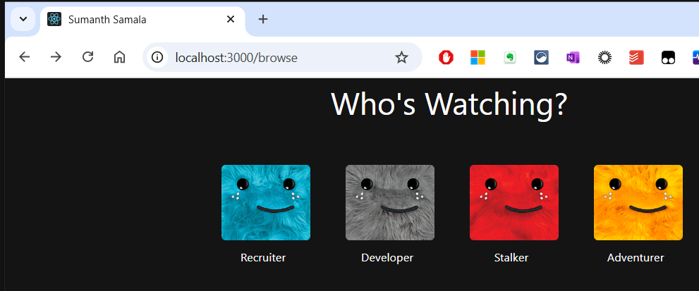

## 🌟 Netflix-inspired Portfolio Template 🌟

Welcome to this Netflix-inspired portfolio template! 🚀 This website can showcase your work, skills, and experiences in web development. It's designed to be lightweight, customizable, and professional while maintaining an approachable style.

You can customize subdomains tailored to different tech stacks, for example:
- 🌟 [java.yourname.com] for Java Spring Boot-related work
- 🌟 [node.yourname.com] for Node.js and backend development
- 🌟 [frontend.yourname.com] for frontend development expertise
- 🌟 [ror.yourname.com] for Ruby on Rails projects


---

## ✨ Features

- 🌍 **Dynamic Content**: Powered by [DatoCMS](https://www.datocms.com) for easy content management
- ⚡ **Fast & Responsive**: Built with modern web technologies for seamless performance
- 🎨 **Customizable**: Modular and easy to adapt to your own needs
- 📈 **Professional Yet Personal**: Highlights projects, skills, and achievements

---

## 🛠️ Tech Stack

This portfolio is built with:

- ⚛️ **React** (Frontend)
- ☁️ **AWS S3 & CloudFront** (Hosting and CDN)
- 🖌️ **Tailwind CSS** (Styling)
- 🛡️ **DatoCMS** (Content Management)
- 🧩 **Other Cool Tools**: GitHub Actions

---

## 📚 Getting Started

Want to set this up locally? Follow these steps:

1. **Clone the Repository**: Copy the repository to your local system.
2. **Install Dependencies**: Use a package manager to install the required dependencies.

```bash
nvm install 18
nvm use 18
```

After upgrading Node.js, clear your node_modules and reinstall:

```bash
rm -rf node_modules
npm cache clean --force
npm install
```

3. **Configure Environment Variables**: Create a `.env` file and set up the necessary API keys and configurations.
4. **Run the Project**: Start the development server.

```bash
npm start
```

5. **Visit the Local Server**: Open your browser and navigate to the local server URL.
   

---

## 🤝 Contribution Guidelines

Contributions are welcome and appreciated! 🥳 To contribute:

1. Fork the repository.
2. Create a new branch for your feature or fix.
3. Commit your changes with a descriptive message.
4. Push your changes to your branch.
5. Open a Pull Request. 🎉

---

## 🐛 Issues and Feature Requests

Found a bug? Have a feature in mind? 🤔 Feel free to raise an issue or suggest a feature!

1. Go to the **Issues** tab in the repository.
2. Click **New Issue**.
3. Provide a clear description of the bug or feature request.
4. If applicable, include screenshots or steps to reproduce the issue.

Your feedback is valuable and helps make this project better for everyone. Thank you for contributing!

---

## 🌟 Acknowledgments

- Thanks to [DatoCMS](https://www.datocms.com) for powering the dynamic content.
- Inspired by countless developers in the open-source community. 💻
- Special shoutout to all contributors—you rock! 🤘

---

## 📜 License

This project is licensed under the MIT License. Feel free to use it, modify it, and share it! 🌈

---
